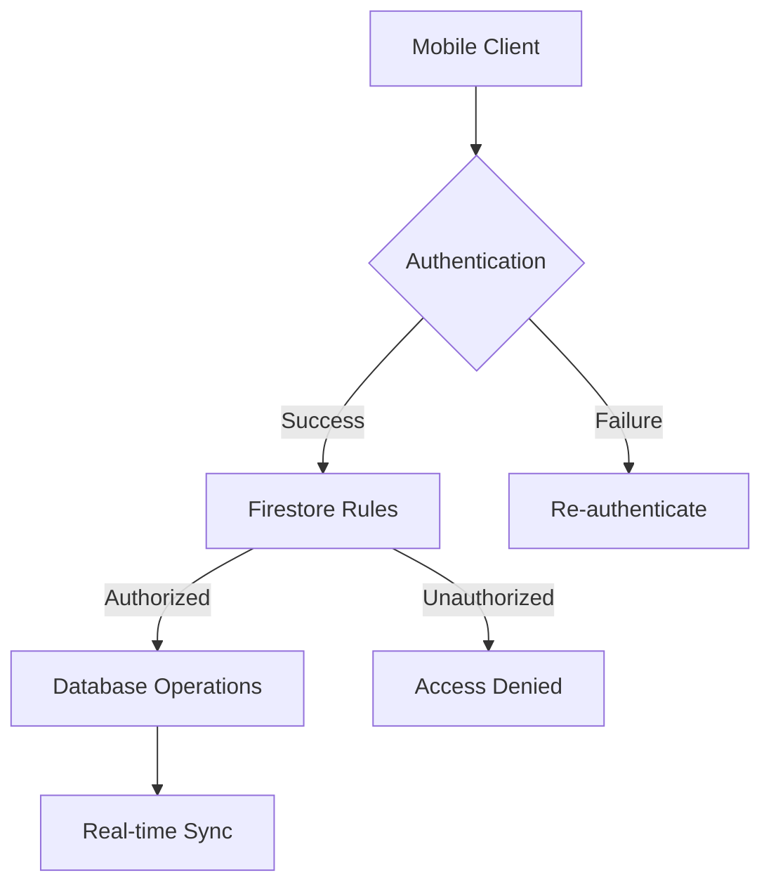
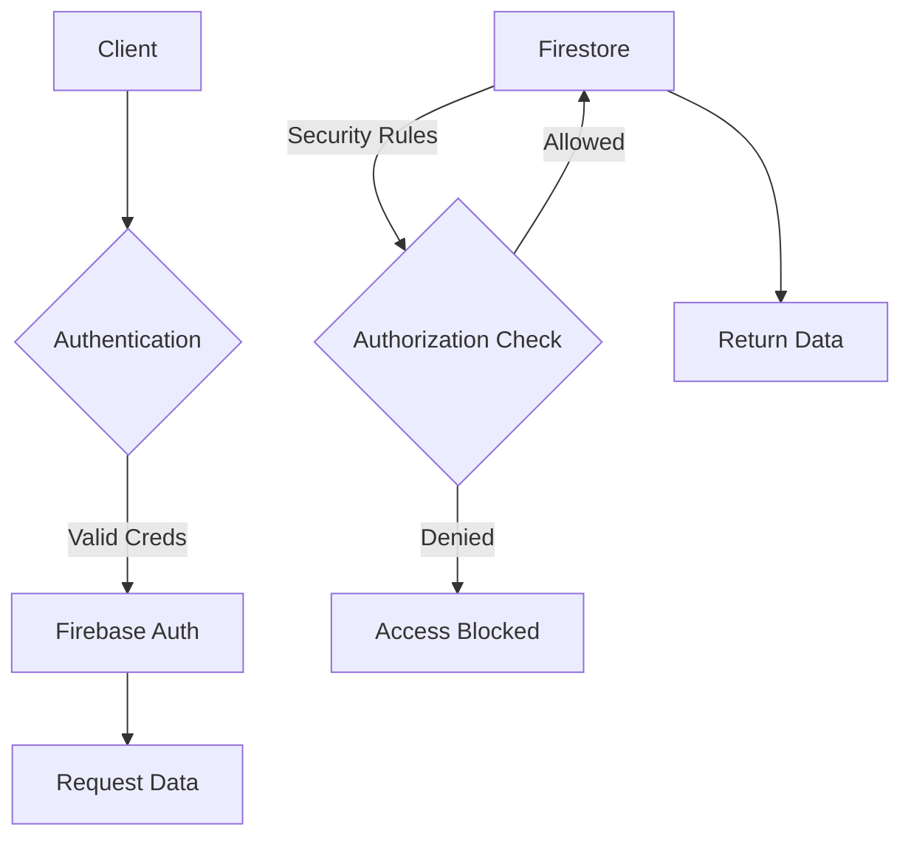

# 🚀 Vevij ERP - Flutter Edition 

  
*(Upload banner to assets/images/banner.png)*

[](https://flutter.dev)
[](https://firebase.google.com)
[](LICENSE)
[](https://github.com/your-org/vevij-erp/actions)

**Enterprise-grade business management** with real-time collaboration, task tracking, and role-based security - powered by Flutter ❤️ & Firebase 🔥



## 🔥 Feature Highlights

| Category          | Capabilities                               |
|-------------------|--------------------------------------------|
| **Core Platform** | Multi-team support • Real-time sync • Offline mode |
| **Security**      | RBAC • Field-level encryption • Audit logs • Compliance |
| **Analytics**     | Custom dashboards • Exportable reports • KPI tracking |
| **Integration**   | Firebase Services • REST APIs • Webhooks • Scheduled jobs |

## 🛠️ Development Setup

### System Requirements
- **OS**: Windows 11/10, macOS 12+, or Linux (Ubuntu 22.04+)
- **RAM**: 8GB+ (16GB recommended for emulators)
- **Disk**: 10GB+ free space
- **Network**: Stable internet connection for Firebase services

### Essential Tools
- Flutter 3.19.5+ (`flutter doctor` should show no issues)
- Android SDK 33+ or Xcode 14+
- Java JDK 11+ (for Android builds)
- Firebase CLI (`npm install -g firebase-tools`)

```bash
# Verify environment
flutter doctor -v
```

## ⚡ Getting Started

1. Clone repository:
```bash
git clone https://github.com/your-org/vevij-erp
cd vevij-erp
```

2. Install dependencies:
```bash
flutter pub get
```

3. Configure Firebase:
```bash
# Requires Firebase CLI
flutterfire configure
```

4. Run development environment:
```bash
# Start emulators
firebase emulators:start --import=./emulator-data

# Launch app with emulator config
flutter run --dart-define=FIRESTORE_EMULATOR_HOST=localhost:8080
```

## 🔌 Firebase Integration

**Required Services:**
- Authentication (Email/Google)
- Cloud Firestore
- Cloud Functions
- Cloud Messaging

**Configuration Checklist:**
1. Create Firebase project
2. Add Android/iOS apps in Firebase Console
3. Download `google-services.json`/`GoogleService-Info.plist`
4. Enable Firestore with test mode rules
5. Setup authentication providers
6. Deploy security rules:
```bash
firebase deploy --only firestore:rules
```

## 📦 Build & Deployment

### Android Builds
```bash
# Debug build
flutter build apk --debug --flavor dev

# Release build
flutter build appbundle --release --flavor prod
```

### CI/CD Pipeline Example (GitHub Actions)
```yaml
name: Production Build
on: [push]
jobs:
  build:
    runs-on: ubuntu-latest
    steps:
      - uses: actions/checkout@v3
      - uses: subosito/flutter-action@v2
      - run: flutter pub get
      - run: flutter test
      - run: flutter build appbundle --release
      - uses: r0adkll/upload-google-play@v1
        with:
          serviceAccountJson: ${{ secrets.GOOGLE_PLAY_SA }}
          packageName: com.vevij.erp
          releaseFiles: build/app/outputs/bundle/release/*.aab
```

## 🔒 Security Architecture

**Multi-layered Protection:**
1. **Authentication**: Firebase Auth with email/password + Google OAuth
2. **Authorization**: Role-based Firestore Security Rules
3. **Data Protection**: Field-level encryption for sensitive data
4. **Monitoring**: Audit logs + real-time security alerts



## 🚨 Troubleshooting

| Issue                      | Solution Steps                                                                 |
|----------------------------|--------------------------------------------------------------------------------|
| Authentication failures    | 1. Verify google-services.json <br> 2. Check Firebase Auth providers <br> 3. Test with emulator |
| Firestore permission denied| 1. Validate security rules <br> 2. Test rules with emulator <br> 3. Check user roles |
| Missing notifications      | 1. Verify FCM setup <br> 2. Check device token registration <br> 3. Test with Postman |
| Performance issues         | 1. Check Firestore indexes <br> 2. Optimize queries <br> 3. Enable caching |

## 🤝 Contribution Guide

1. **Fork** the repository
2. Create **feature branch** (`git checkout -b feature/amazing-feature`)
3. **Commit** changes (`git commit -m 'Add amazing feature'`)
4. **Push** to branch (`git push origin feature/amazing-feature`)
5. Open **pull request**

**Quality Standards:**
```bash
# Format code
flutter format .

# Run linter
flutter analyze

# Execute tests
flutter test
```

## 📄 License

This project is licensed under the [MIT License](LICENSE) - see the LICENSE file for details.

---
**Maintained with ❤️ by Vevij Solutions**  
*Need enterprise support? Contact team@vevij.com*
